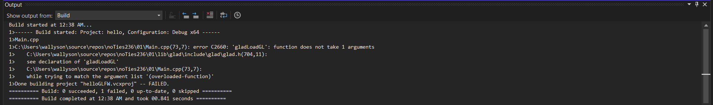
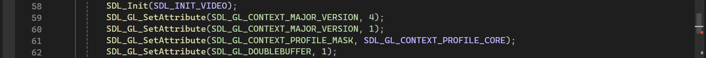
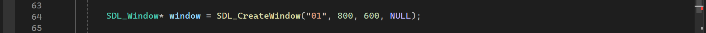
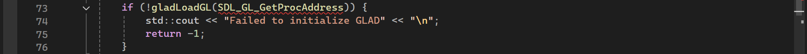

## Erro: gladLoadGL não aceita SDL_GL_GetProcAddress

**Código do erro:** C2660  
**Arquivo:** Main.cpp, linha 73

### O que eu queria fazer?

Eu estava migrando o projeto de GLFW para SDL3. Após configurar a SDL3 
e o GLAD, tentei inicializar o GLAD usando a sintaxe que conhecia do GLFW:

gladLoadGLLoader((GLADloadproc)SDL_GL_GetProcAddress)

Quando fui compilar, o projeto falhou com o erro C2660.

### Por que deu errado?

O problema tinha três causas, e entender a ordem delas importa.

A causa raiz foi que eu repeti SDL_GL_CONTEXT_MAJOR_VERSION duas vezes 
ao configurar o contexto OpenGL, quando a segunda linha deveria ser 
SDL_GL_CONTEXT_MINOR_VERSION. Isso fez o contexto ser criado com OpenGL 1.x 
— uma versão dos anos 90 — em vez de OpenGL 4.1. Com um contexto tão antigo, 
o GLAD não conseguia carregar as funções modernas de qualquer jeito.

A segunda causa foi a ausência da flag SDL_WINDOW_OPENGL na criação da janela. 
Na SDL3, sem essa flag a janela é criada sem suporte a contexto OpenGL, 
e tudo que vem depois falha silenciosamente — o contexto não é criado 
de verdade, mesmo sem dar erro explícito.

A terceira causa foi usar a sintaxe antiga do GLAD. A versão do GLAD 
que eu tenho declara gladLoadGL sem nenhum argumento — o mecanismo de 
carregamento já está embutido internamente. Quando eu passei 
SDL_GL_GetProcAddress como argumento, o compilador reclamou porque 
a assinatura da função não aceita parâmetros. Essa sintaxe era correta 
para versões antigas do GLAD com GLFW, mas não se aplica aqui.

### Como foi resolvido?

Três correções foram necessárias. Primeiro, corrigir MAJOR_VERSION para 
MINOR_VERSION na segunda linha de configuração do contexto. Segundo, 
adicionar a flag SDL_WINDOW_OPENGL na chamada SDL_CreateWindow. Terceiro, 
trocar gladLoadGLLoader((GLADloadproc)SDL_GL_GetProcAddress) por 
simplesmente gladLoadGL(), sem nenhum argumento.